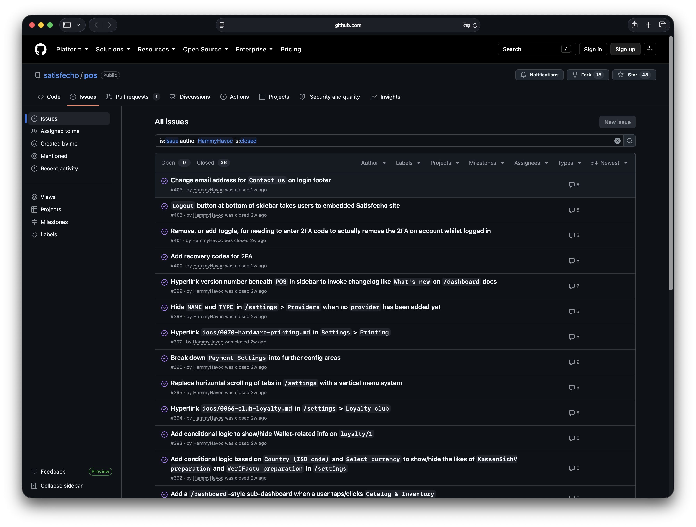
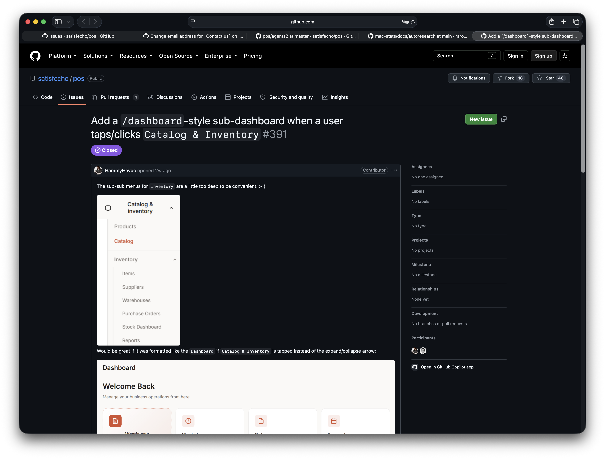
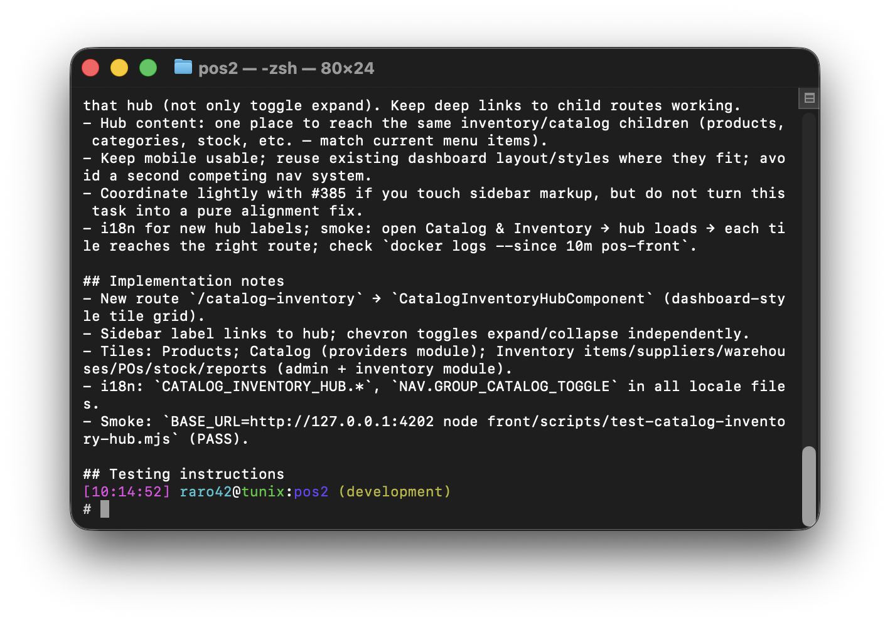
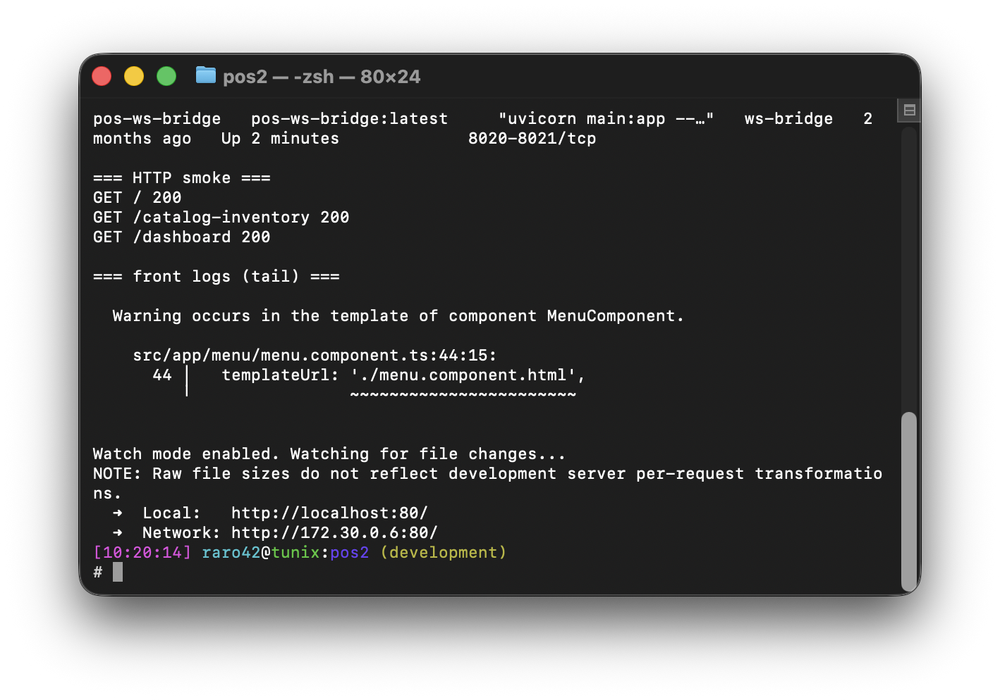
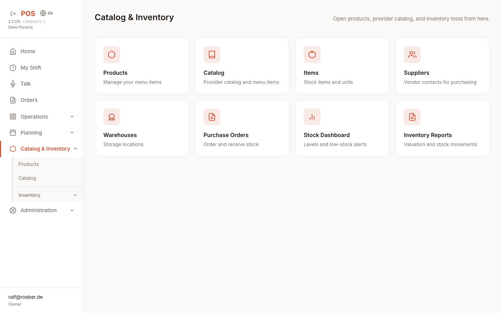
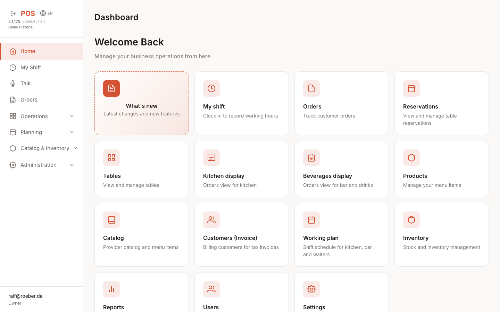
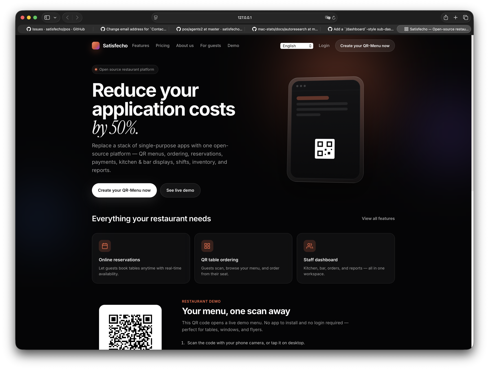
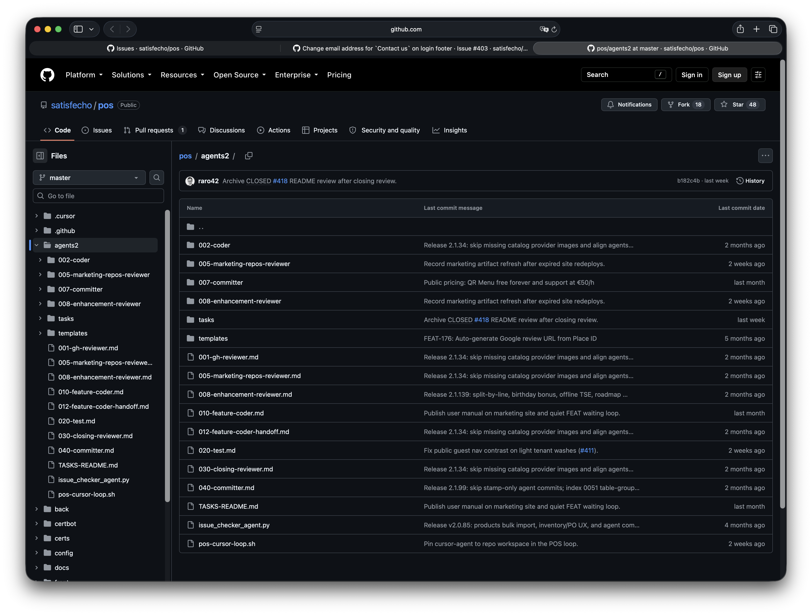
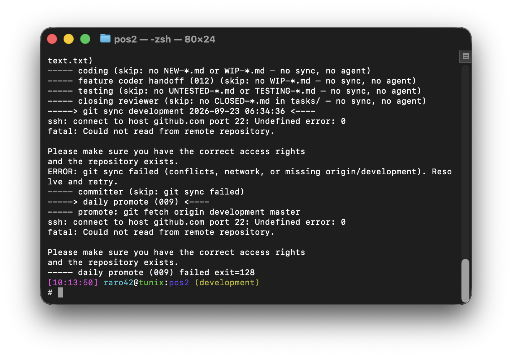
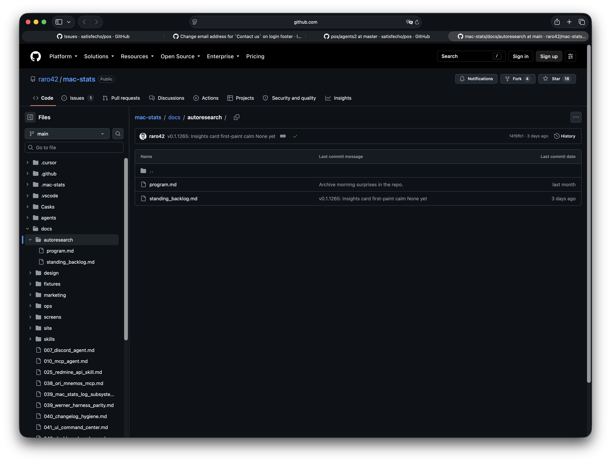

# No harness works best for me

Meaning: no agent framework. The loop is bash, folder names, and gh. Cursor is a worker.

Coder slot is swapable: Cursor, Claude Code, OpenCode, whatever can edit the tree. The loop does not care.

**Date:** 2026-09-29  
**Author:** [@raro42](https://github.com/raro42)  
**Repo:** [raro42/agents-explained](https://github.com/raro42/agents-explained)

Most agent posts sell a new framework. I sell the opposite.

I run product work with a **thin shell loop**, markdown task files, and local models for triage. The loop is mostly `bash`, `gh`, and folder renames. Cursor (or another coder agent) is a **worker**, not the brain.

This page is the long form behind an X post. Screenshots and exports live under [`raw/`](../raw/).

---

## The claim in one diagram

```text
GitHub issue
    │
    ▼
shell preflight          ← cheap; skip Cursor if nothing to do
    │
    ▼
local model (Ollama)     ← classify / triage / draft tasks
    │
    ▼
coder agent (Cursor)     ← edit product code
    │
    ▼
tester                   ← evidence required
    │
    ▼
commit + review + close  ← local where possible; link back to the issue
```

When cloud models fail, the **control plane** still runs: preflight, stamps, skips, local triage. Cloud is optional capacity for hard edits.

---

## Why “no harness”

This is not a hot take from the sidelines. I ran the big ones.

| Tried | What I learned |
|-------|----------------|
| [pi](https://pi.dev) / Pi-style local agent loops | Strong idea. Still a product surface between you and the work. |
| OpenCode | Good for “agent in a box.” Control flow lives in someone else’s release. |
| Hermes | Useful pieces. Not a full factory for issue → code → test → close. |
| OpenClaw (any flavor) | Ambitious. Also heavy. Updater churn and surprise breaks are real. |
| Harness code inside [mac-stats](https://github.com/raro42/mac-stats) itself | Even *my* thicker harness grew holes. I kept cutting it back. |

Harnesses are big. They have holes. They break every once in a while — yes, OpenClaw updaters, I am looking at you.

When something fails at 3 a.m., I want to read **fifty lines of bash and a task filename**, not a framework stack.

So the loop I keep is thin on purpose:

| Piece | What it is |
|-------|------------|
| Orchestrator | One shell script on a timer |
| Roles | Markdown prompts (`001` reviewer, coder, tester, closer, committer) |
| Queue | Task files: `FEAT-` → `WIP-` → `UNTESTED-` → `TESTING-` → `CLOSED-` → `done/YYYY/MM/DD/` |
| Gates | Shell preflights — no agent call if the queue is empty |
| Local AI | Ollama (and optional llama.cpp) for log triage and cheap labels |

Same spine shows up in public trees:

- [satisfecho/pos `agents2/`](https://github.com/satisfecho/pos/tree/master/agents2) — production POS loop (`pos-cursor-loop.sh`)
- [raro42/mac-stats `agents/`](https://github.com/raro42/mac-stats/tree/main/agents) — product + autoresearch (thin loop after cutting harness fat)
- [raro42/ai-stock-checker `AGENTS.md`](https://github.com/raro42/ai-stock-checker/blob/main/AGENTS.md) — overnight improve loop

We also run the same loop pattern on a private customer repo. No internals here.

---

## Proof: HammyHavoc on `satisfecho/pos`

A real user ([HammyHavoc](https://github.com/HammyHavoc)) filed a large UX/settings batch on [satisfecho/pos](https://github.com/satisfecho/pos).

**Capture (2026-09-29):** **36 closed** issues, **0 open**, author filter `HammyHavoc`.



Filter: [issues by HammyHavoc, closed](https://github.com/satisfecho/pos/issues?q=is%3Aissue+author%3AHammyHavoc+is%3Aclosed).

Raw export: [`raw/sources/hammyhavoc-satisfecho-pos-issues.json`](../raw/sources/hammyhavoc-satisfecho-pos-issues.json).

### What the loop did on one issue (#391)

Issue: [Add a Catalog & Inventory hub · #391](https://github.com/satisfecho/pos/issues/391).

Public agent trail (comments on the issue):

1. **Agent 001** — created `FEAT-391-…` task  
2. **Agent 010** — implemented hub route; moved task to **UNTESTED**  
3. **Tester** — **PASS** on Docker smoke  
4. **Closing reviewer** — archived task; closed the issue  

Full text: [`raw/sources/issue-391-agent-trail.txt`](../raw/sources/issue-391-agent-trail.txt).



Archived task file (local checkout proof):



Day folder listing: [`raw/sources/pos-done-2026-09-14.txt`](../raw/sources/pos-done-2026-09-14.txt).

### Live product outcome (local Docker)

Stack up on `127.0.0.1:4202`. The hub from #391 is real UI, not a mock.







Landing (public surface): 

### Where the roles live



Orchestrator: `agents2/pos-cursor-loop.sh`. Docs: [`docs/agent-loop.md`](https://github.com/satisfecho/pos/blob/master/docs/agent-loop.md) in that repo.

---

## Preflight before spend

The loop does **not** wake Cursor on every tick.

Examples from POS:

| Gate | Effect |
|------|--------|
| No untracked GitHub issues | Skip expensive 001 Cursor path when only log noise remains |
| No `FEAT-` / `NEW-` / `WIP-` | Skip coder |
| FEAT waiting for human | Park; no spam comments |
| Stamp-only dirty tree | Do not burn a committer agent on stamp files |

That is the “no harness” move: **shell decides if an LLM is needed**.

Idle cycle: preflight skips, no Cursor burn. Clean extract: [`raw/sources/pos-cursor-loop-preflight-skips-clean.txt`](../raw/sources/pos-cursor-loop-preflight-skips-clean.txt).



---

## Local AI and fallbacks (outages)

In September 2026, major cloud AI products had overlapping outages (ChatGPT, Claude, Grok, and Cursor degradation in the same window). Teams that put the **whole** agent brain in one cloud API went dark.

My split:

| Layer | Runs where | Outage behaviour |
|-------|------------|------------------|
| Shell loop + git + `gh` | Laptop / host | Keeps ticking |
| Ollama triage / classify | Local | Still labels SKIP vs ESCALATE |
| Cursor coder | Cloud models behind Cursor | Degrades when providers fail |
| Tester / archive scripts | Local evidence | Still verifies what already shipped |

Lesson: **keep decisions local; rent generation.** Company data stays off random classifier APIs when you own the triage box.

---

## Decision models (Laya), not chat-as-classifier

Preflight and result gates need a **label + confidence**, not a paragraph.

That is the [Laya](https://github.com/NandhaKishorM/laya) idea (Apache 2.0, self-host): typed Choice / Bool / Score. See also [Jev vs Laya](https://dev.to/jamilxt/jev-vs-laya-the-same-ai-idea-one-closed-and-one-open-3c6e). Closed cloud “System One” APIs (e.g. Jev) are the wrong shape for private customer data.

In the loop:

```text
issue / log signal
  → decision (label + confidence) or rules fallback
  → only then spawn coder / tester
result
  → keep / reopen / close (again: label, not essay)
```

I do **not** need a second giant chat model to say “this is a FEAT.” I need a small decision.

---

## Autoresearch sibling

The same ratchet idea shows up in product autoresearch (Karpathy-style keep/discard), e.g. mac-stats:



Agent coding loops and autoresearch share one spine: **metric, budget, revert on fail, ledger of attempts**. Different domains; same discipline.

---

## What to copy

1. One shell orchestrator.  
2. Role prompts as markdown.  
3. Task files as the only queue.  
4. Preflight before every paid agent call.  
5. Local model for classify / triage / close text.  
6. Cloud/IDE coder only for hard edits (Cursor, Claude Code, OpenCode, …).  
7. Comment the issue with each stage so humans can audit.

Do not start with a multi-agent product. Start with a timer and a folder.

---

## Links

| Resource | URL |
|----------|-----|
| This repo | https://github.com/raro42/agents-explained |
| POS agents | https://github.com/satisfecho/pos/tree/master/agents2 |
| mac-stats agents | https://github.com/raro42/mac-stats/tree/main/agents |
| Stock checker AGENTS | https://github.com/raro42/ai-stock-checker/blob/main/AGENTS.md |
| Karpathy LLM Wiki pattern | https://gist.github.com/karpathy/442a6bf555914893e9891c11519de94f |
| Laya | https://github.com/NandhaKishorM/laya |

---

## Contribute

Use [GitHub Issues](https://github.com/raro42/agents-explained/issues). MIT license.
